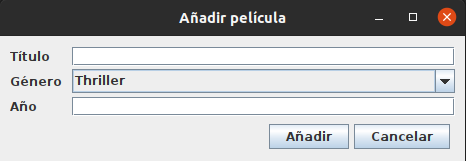

# GUI Forms

Los siguientes ejercicios deben implementarse utilizando el editor de GUI Forms

## Parte 1 - Tabla de películas (2 puntos)

Modifica `FilmsApp` de forma que la tabla muestre correctamente los datos de 
las películas definidas en el código.

### Calificación  (2 puntos)

El ejercicio puntuará cero puntos en los siguientes casos:
- No compila
- No arranca la ventana
- No se ha configurado la tabla y su modelo correctamente

## Parte 2 - Diseño de formularios (2 puntos)

Crea un formulario llamado `AddFilmForm` que permita introducir los datos de una película.

- Carga en el `JComboBox` los valores: Thriller, Terror, Comedia y Drama.
- Los botones deben estar centrados
- El año de la película debe ser un número

### Calificación  (2 puntos)

El ejercicio puntuará cero puntos en los siguientes casos:
- No compila
- No arranca la ventana

## Parte 3 - Navegación (3 puntos)

### Barra de menú

Añade al JFrame una barra de menús con DOS menús:
- Películas
  - Agregar
  - Eliminar
  - Modificar
- Actores
  - Listar
  - Añadir
  - Eliminar

### Diálogo de añadir

Al pulsar el botón "Añadir" o el JMenuItem "Añadir" del menú Películas, se debe abrir un `JDialog` con el formulario 
definido en `AddFilmForm`

### Calificación  (3 puntos)

El ejercicio puntuará cero puntos en los siguientes casos:
- No compila
- No arranca la ventana
- No hay ningún elemento de navegación
