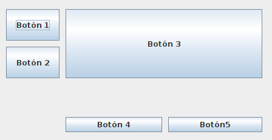

# Layouts y componentes

Implementa los siguientes formulario PROGRAMÁTICAMENTE.

## GridBayLayoutExercise.java

Coloca los botones de esta manera usando GridBagLayout

Consideraciones:
- Los botones de la última fila solo se estiran horizontalmente
- Los botones de la última fila deben estar en el sur de su celda
- El resto de botones se estiran vertical y horizontalmente
- Los botones de la primera y segunda fila se agrandan más rápido que los de la tercera fila

## ListenerExercise.java

Modifica el código para que:
- Cuando se pulse el botón "Añadir" se añada el elemento seleccionado en el JComboBox a la lista de la derecha.
- Cambia el color del botón cuando el ratón entre en el área del botón a `Color.red`
- Cuando el cursor del ratón sale del botón el fondo debe volver a `Color.lightGray`

Métodos que se pueden usar:
- `jComboBox.getSelectedItem()` 
- `model.addElement(value)`
- `button.setBackground(color)`

## Calificación  (3 puntos)

El ejercicio puntuará cero puntos en los siguientes casos:
- No compila
- No arranca ningún ejercicio del proyecto
- Los ejercicios se deben realizar PROGRAMÁTICAMENTE, las soluciones realizadas con el editor gráfico (GUI Forms) puntuarán cero.